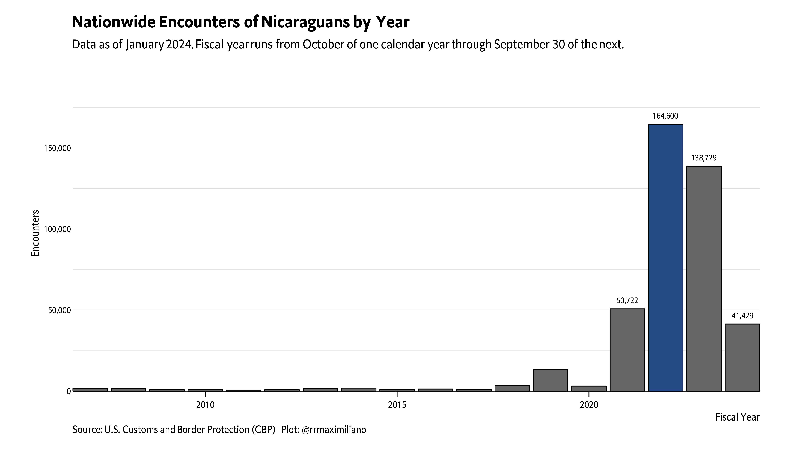

<!-- README.md is generated from README.Rmd. Please edit that file -->

# Migrants (USBC)

``` r
data
#> # A tibble: 41,400 × 5
#>     year country     region    border migrants
#>    <dbl> <chr>       <chr>     <chr>     <dbl>
#>  1  2007 Afghanistan Southwest BBT          NA
#>  2  2007 Afghanistan Southwest DRT          NA
#>  3  2007 Afghanistan Southwest ELC          NA
#>  4  2007 Afghanistan Southwest EPT          NA
#>  5  2007 Afghanistan Southwest LRT          NA
#>  6  2007 Afghanistan Southwest RGV          NA
#>  7  2007 Afghanistan Southwest SDC          NA
#>  8  2007 Afghanistan Southwest TCA          NA
#>  9  2007 Afghanistan Southwest YUM           1
#> 10  2007 Afghanistan Northern  BLW          NA
#> # … with 41,390 more rows
#> # ℹ Use `print(n = ...)` to see more rows
```

## Nicaragua

<!-- --><!-- -->
